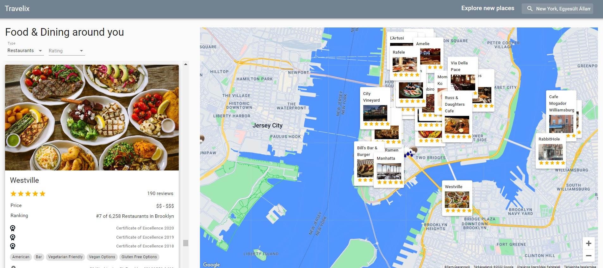

# Shoppy Admin Dashboard

This was definitely a challenging project considering the deadline I set for myself. Fortunately, I managed to accomplish my goal of learning more about Axios, APIs, Google Cloud Platform, Google Maps React, TailwindCSS and React.js in general.

---

### [See live version](https://travelix-app-ruben.netlify.app/)

### Description

Travelix is a full-fledged and responsive travel companion that dynamically shows the best restaurants, hotels and attractions based on your or your searched location. On load it displays your current location, but you can search for your future destinations in advance to get familiar with your options. Travelix displays each result in an informative card that contains the image of the location, links, previous awards and ratings.

### Features

- Map is loaded with the user's current location
- Users can select their desired type of location (restaurants, hotels, attractions) from a dropdown menu
- Users can see the local weather on the map
- Users can filter results based on their ratings
- Users can search for any desired location and see results accordingly
- Users can move around on the map and see the results dynamically update
- Users can click on a location card on the map and see the result list will scroll to that location automatically

### Technologies used

- Material UI
- React
- RapidAPI
- Axios
- Netlify for deployment

### What did I learn?

This project helped me improve my skills in multiple areas.

- I got more experience using React.js hooks, but especially the useRef hook
- I familiarised myself with Axios
- Deployment with Netlify
- Managing multiple states and state changes at once
- Google Maps React
- Google Cloud Platform

### Credit

_The project was inspired by [Adrian](https://www.completepathtojavascriptmastery.com/)_
